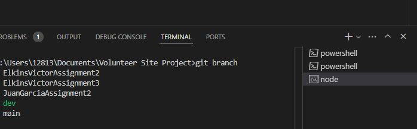
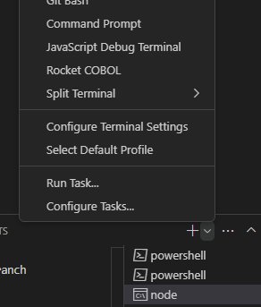
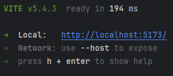

## Steps To Run:

1. **Clone the repository**:
```bash 
git clone https://github.com/Victor-Elkins/Volunteer-Site-Project.git
```
2. **Navigate to the project's directory**:  
```bash 
cd Volunteer-Site-Project
```
3. **Navigate to backend and install any dependencies**:  
```bash
cd backend
npm install
```
4. **Start the backend server**:
```bash
node server
```
5. **Open a new command prompt by clicking the '+' icon, or a new terminal window.**:


6. **Navigate to the frontend directory in the new terminal**:
```bash 
cd Volunteer-Site-Project/frontend
```
7. **Install any dependencies and start the frontend server**:
```bash 
npm install
npm run dev
```

8. **Either left click on the link output in the terminal, or navigate to http://localhost:5173/ in your local browser**:


### Troubleshooting:
Sometimes, depending on someone's environment, running ```npm install``` will throw some errors or warnings. Running the following command a few times should sort the issue out:
```bash
npm audit fix
# If the regular fix doesn't work, add the force flag.
npm audit fix --force
```